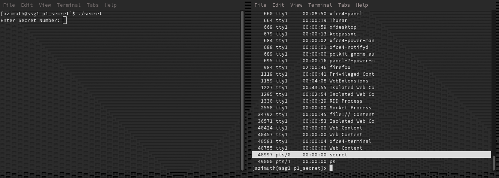

gdb is most often used for debugging compiled programs. However, it is also very useful as a first-line investigative tool. In this activity, we will use gdb to find a secret integer that is generated randomly at runtime.

While printing the value of a variable seems like one of the easiest things you can do, we will actively try and run into as much useful newbie info as possible. That way, we can get the frustration out of the way early. After all, you won't want to use gdb for your classwork if you aren’t confident navigating it!

Start by compiling secret.c using the following command. Note the use of the debug flag `-g`, which will include, among other things, the original source code in the finished executable file.

	gcc -g -o secret secret.c
	
Our ultimate goal in this activity will be to read the value of `int secret` after it’s generated, so we can enter it in the running program and see the “That’s Correct!” message. 

At this point we can either start the program directly from gdb, or start the secret program first and attach gdb while it's already running. We will do the latter initially, to better get a hold of gdb's investigative power; Since in a real use case, we may only decide to start debugging after something has already gone wrong.

Start the executable in its own terminal with `./secret` We need to know the PID of the process we just started, so open your second terminal, run `ps -a` and look for the name "secret", the number in the left column is the running program's PID.

Start gdb in your second terminal. You will likely need to run it with `sudo` as we will be attaching to a process that gdb doesn't "own" (In this case, gdb isn't the *parent* process of secret.). 

For this activity, we will use the slightly more readable  TUI mode. This mode may not be available depending on your terminal, and this is especially common when debugging embedded systems over serial, so always be prepared to work a bit harder in CLI mode if that is the case.

	gdb --tui
	
Now, attach to the running secret process using the attach command in gdb. Provide the PID that we just looked up.

	(gdb) attach 48997
	
When we attach to a process in this fashion, we will not initially have source code available, because gdb doesn't know what file the process was loaded from, which contains the source code we included when compiling. We know where the file is though, so we just need to use the symbol-file command to load it.

	(gdb) symbol-file secret
	
Note that gdb uses the directory it was launched from as the *working directory*. If you were one level further up in this repository when you launched gdb, your command would instead look like:

	(gdb) symbol-file p1_secret/secret
	
You can see the current working directory using `pwd`, and change it using `cd`, just like in a regular old bash terminal. If you started gdb with `sudo` there's a high chance your working directory is currently /root . If this is the case, you can skip having to `cd` to the project by restarting gdb with the `--cd=` option set to the current directory.

	gdb --tui --cd=.

Whenever you use `symbol-file`, refresh the source code window by running `list`

	(gdb) list
	
Now we should see the source code almost exactly as it appears in the source file secret.c.

However, the program is not actually stopped in this part of the code. Since we started debugging a running process, we are likely paused several levels deep in the scanf function. Use the backtrace (`bt`) command to see where we are.

(picture)

At the bottom of our stack trace we can see the function main. We would like to get out of scnaf, back to main, so we can have access to `int secret`. We can't access it right now even though we can see it in the source code, because it is outside the current *stack frame*. Remember that it is not valid to access a local variable outside the scope of the function that created it!

An easy way to get back to the main function is to put a breakpoint on the line containing the if statement. A breakpoint is used to pause execution just before the selected line.

	(gdb) breakpoint 17
or
	(gdb) b 17
	
Now we can run `continue` to unpause program execution. Notice how the `(gdb)` prompt no longer appears in your debugging terminal, this is because the program is running again, waiting for user input; scanf still expects us to enter something. Go back to the terminal running secret and enter any number, then press enter. 

Hold on a moment, what if our debugging program never pauses on its own? For example, if we have an infinite loop that was written incorrectly, or an algorithm that has gotten stuck? In that case, we can always use Ctrl-C to stop wherever the program may be at that instant. Yes, the traditional “Close the program” hotkey!

Back to the activity at hand. Our program will break before the if statement. Execution is now back in the main function, and we can simply read the secret int using the `print` command.

	print secret

Note the secret number for later. The $1 on the left side of the output is an automatically chosen name for quick reference, which you can use in later commands instead of typing the full number. These are used just like bash variables, and can be included in more complex statements. We will see how this can be very convenient when dealing with addresses in the next activity.

All we have to do now is continue our program again, and enter our secret number. Let’s also delete our breakpoint so it doesn’t pause again. The `delete` command can be used to remove any breakpoints we created, calling it with no arguments will let you delete all breakpoints. To see what breakpoints currently exist, simply run `breakpoint` with no arguments. We could have also used a temporary breakpoint `tb`  which is just a breakpoint that is deleted the first time it is hit.

Go back to the terminal running secret and enter your secret number. Congratulations!

Notes:

Add section on `s` `n` and `ret`
A

